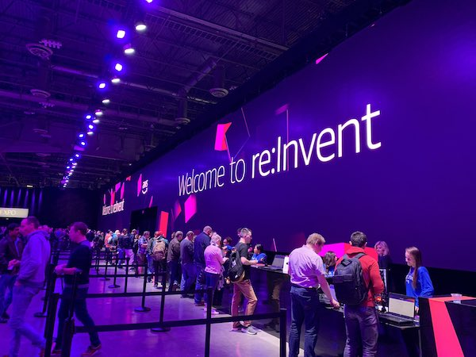

*AWS re:Invent 2018 has officially begun!*

The biggest Cloud event of the year is here.

AWS re:Invent is a great event for anyone interested not only in Cloud computing but other areas such as software systems development, application delivery, storage system, databases, how technology is being used in various industries.  

Being at this event provides you an opportunity to learn about the latest technology trends and where you can focus your energies in your career or as a contributor in your company/business.    

Reinvent offers various kinds of learning at the event. There are sessions that are presented by AWS experts, chalk talks, workshops, keynotes, bootcamps, and a lot more.

All the sessions will be recorded and be available on [AWS Youtube channel](https://www.youtube.com/user/AmazonWebServices/). 

photo courtesy: [@sys_less](https://twitter.com/sys_less) 