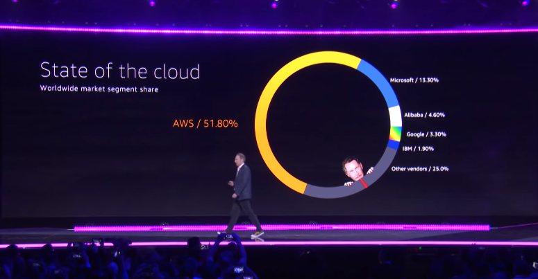
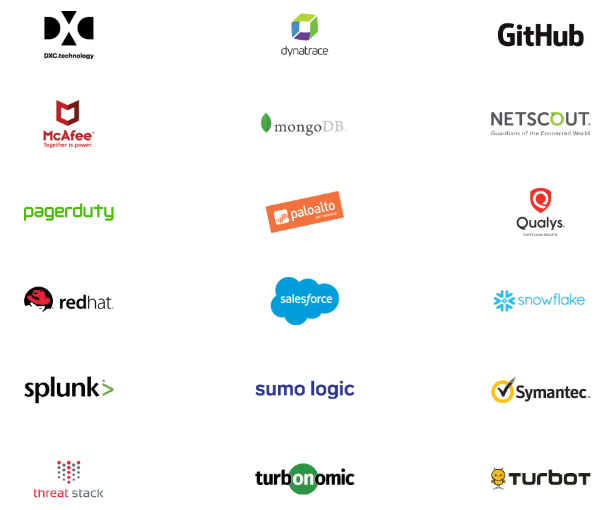

## AWS re:Invent 2018 Recap

As we all know, the AWS re:Invent is a learning conference hosted by Amazon web services for the global cloud computing community. What I like about this conference is that everyone has a chance of learning something new. There are plenty of options to learn, network with others and have fun! There is even a dedicated [unofficial website](http://conferenceparties.com/reinvent2018/) for the re:Invent related parties!

It’s all kind of too easy to get worn out by the 50,000+ attendees which surpassed that of last year, jamming multiple hotels the length of the Las Vegas strip, from Mandalay Bay on the south to the Wynn and Encore to the north.

We recap everything that happened at the AWS re-invent at Las Vegas and this highlighted Services for AI, blockchain tools, security and compliance, machine learning, analytics and big data and a lot of hatred for Oracle were revealed.

The Session overview at the AWS re:invent included:

- Keynotes & [Announcements](https://aws.amazon.com/new/reinvent/)
- AI & ML
- Serverless
- Containers
- Database management
- Amazon game tech

_(Image courtesy: screenshot from the AWS Andy Jassy Keynote [Youtube video](https://youtu.be/ZOIkOnW640A?t=326))_

The CEO of AWS, Andy Jassy had a band during his keynote. Jassy didn’t talk all that much about AWS rivals apart from Microsoft and Oracle databases. But the references to the competition wasn’t all that hidden. If you doubted that AWS premier technology vendor, this year’s conference revealed a much broader goal and erased such doubts.

The big theme from this AWS was that its long line of innovation gives builders the right tools to get the job done. Jassy talked about liberating builders from been boxed in by the legacy system and enterprises focused on everything but the customer.
Jassy said

_“We do not believe in one tool to rule the world, we want you to use the right tool for the right job”._

He also mentioned that...

_Builders have been constrained by the legacy infrastructure they have had. That is frustrating. Most builders didn't decide to join a business to do the same thing over and over. That is demoralizing. They've trained their builders to not innovate on customer experience._

Amazon launched a collection of services as well as megaservices (services that manages services). AWS aims at making it easy to manage its services across an enterprise.

**ANYTHING YOU CAN BE, I CAN BE GREATER
SOONER OR LATER, I AM GREATER THAN YOU.**

CTO Werner vogels said moving off of Oracle’s data warehouse was the happiest day at AWS. He also revealed that Amazon has moved Off of Oracle databases in its consumer business and has almost completed this migration from the database.

Vogel mentions that the current database from the likes of Oracle were built in the 1980’s and 1990’s.

The most surprising part of the AWS marathon keynotes is that the cloud provider launched [AWS Outposts](https://aws.amazon.com/outposts/), an interesting effort to sell hardware and software on premises. In some ways, AWS and VMware is setting the stage for some hyper converged infrastructure disruption. 

### AWS Goes Blockchain…

Jassy has said that his company has spent a decent amount of time understanding why customers want blockchain rather than a database.
Jassy added

_“Even though we have a lot of customers that run blockchain on top of us, we just haven’t seen so many blockchain examples that couldn’t just be solved by a database”
"The culture inside AWS is that we don't just build things... we understand what problem you want to solve and we then solve it for you."_

But going back to that unique theme of machine learning, one of the advantages of cloud is that is meant to simplify computing for everyone. But as one size does not fit all, AWS has grown its portfolio of EC2 instances and managed services over the years to the point where choosing the right mix can be daunting. A helpful move toward that direction is a new intelligent tiering service for S3 storage that uses machine learning to determine if your data can be moved to a cooler, cheaper tier. But we're awaiting the day when AWS finally unveils a machine learning tool that analyzes your workload and data to recommend the best combination of EC2 instances.

The strength of the event and the AWS could be seen by looking at hundreds of [sponsors](https://reinvent.awsevents.com/partners-sponsors/sponsor-list/) and partners (~close to 400 of them) that were set up on the Venetian's grand expo floor. These are the likes of heavy weights such as Accenture, VMWare, Tableau, Cisco, HP Enterprise and other big players such as Atlassian, CloudCheckr, Gitlab, HashiCorp, Elastic, etc. 

(Image courtesy: sample of sponsors list screenshot from the AWS re:Invent sponsors web page)

Even if you are not one of those 54,000+ re:Invent 2018 attendees in Las Vegas you can catch up on all the events, announcements and sessions online. 

Some useful Links:

- All the announcements from the event by category could be found here: https://aws.amazon.com/new/reinvent/ 

- Video playlists of the re:Invent 2018 [breakout sessions](https://www.youtube.com/user/AmazonWebServices/playlists?view=50&flow=grid&shelf_id=33)  available at AWS Web Services [Youtube channel](https://www.youtube.com/user/AmazonWebServices/).

- AWS Online [Tech Talks](https://aws.amazon.com/blogs/aws/learn-about-new-aws-reinvent-launches-december-aws-online-tech-talks/) as a follow up to the AWS re:Invent 2018 product and service announcements.

